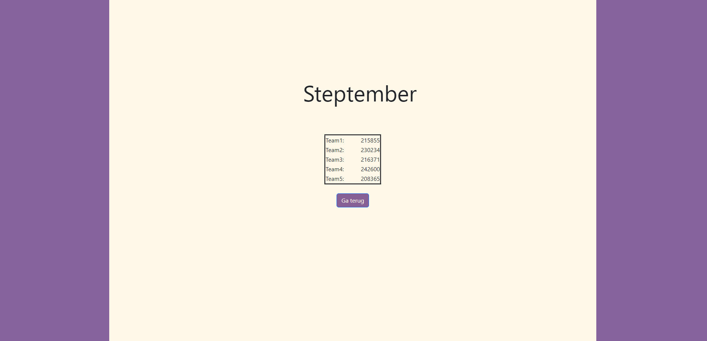

# ***Steptember***

#

#

#

#
<h2>Omschrijving</h2>

<p1>Dit is een website die de array in een tabel. </p1>
<p2>Als je als admin inlogt dan krijg je alle gegevens van de teams te zien, maar als je als team2 inlogt dan krijg je alleen je eigen team te zien. </p2>
<p3>Je kan kiezen of je gemiddelde of aantal te zien.</p3>
<p4> Gemaakt met HTML, PHP en CSS.<p4>  
